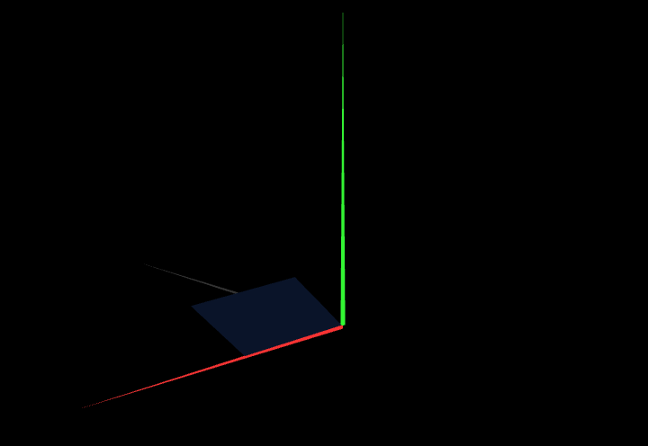

# CG 2023/2024

## Group T02G01

## TP 1 Notes

- In exercise 1 we had difficulties in configuring the checkboxes. We highlight th need to define the paralellogram indexesboth clockwise and counter-clockwiser for the figure to be double-sided.
- In exercise 2 we don't have any particular remark or difficulty, as it was a mere expansion of the previous exercise.

Final result with all the figures of both exercises.

The "other side" of the parallelogram.

Result with the figures of exercise 1.
