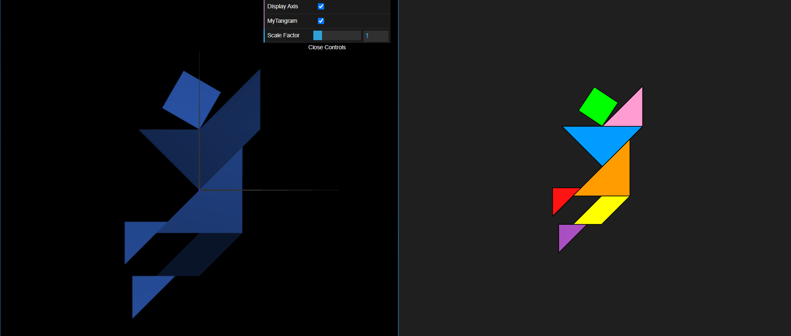
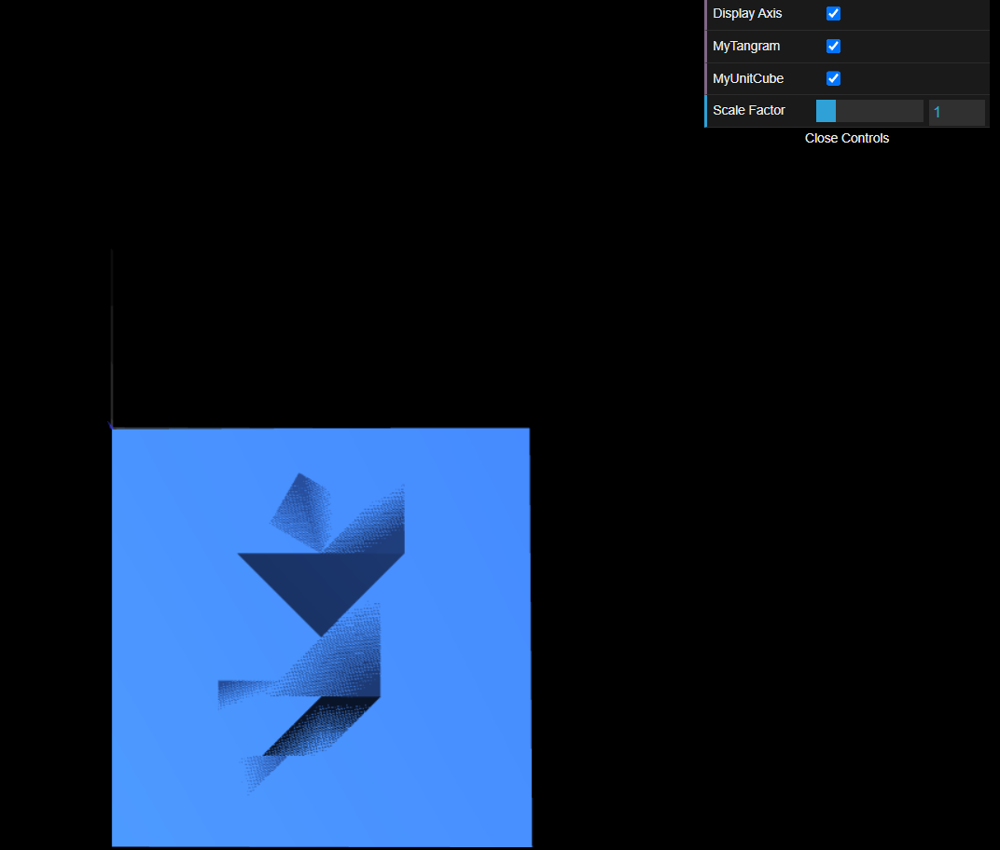
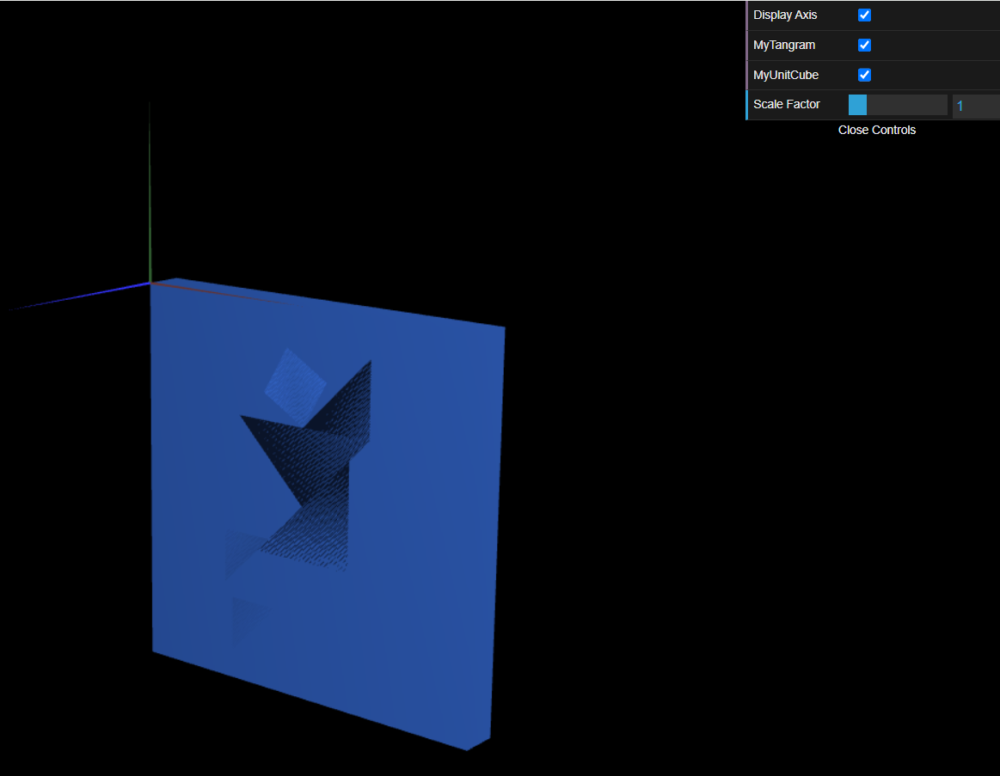

# CG 2023/2024

## Group T02G01

## TP 2 Notes

- In the first exercise, it took some time for us to get used to the different geometrical transformations in WebGL.
- In the second exercise, we had no particular issue, since it was a mere expansion of what we had done so far.

