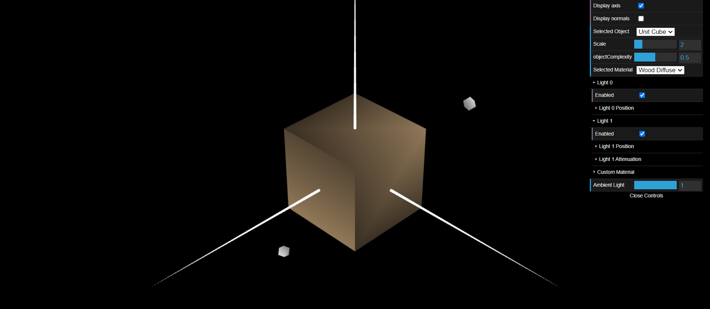
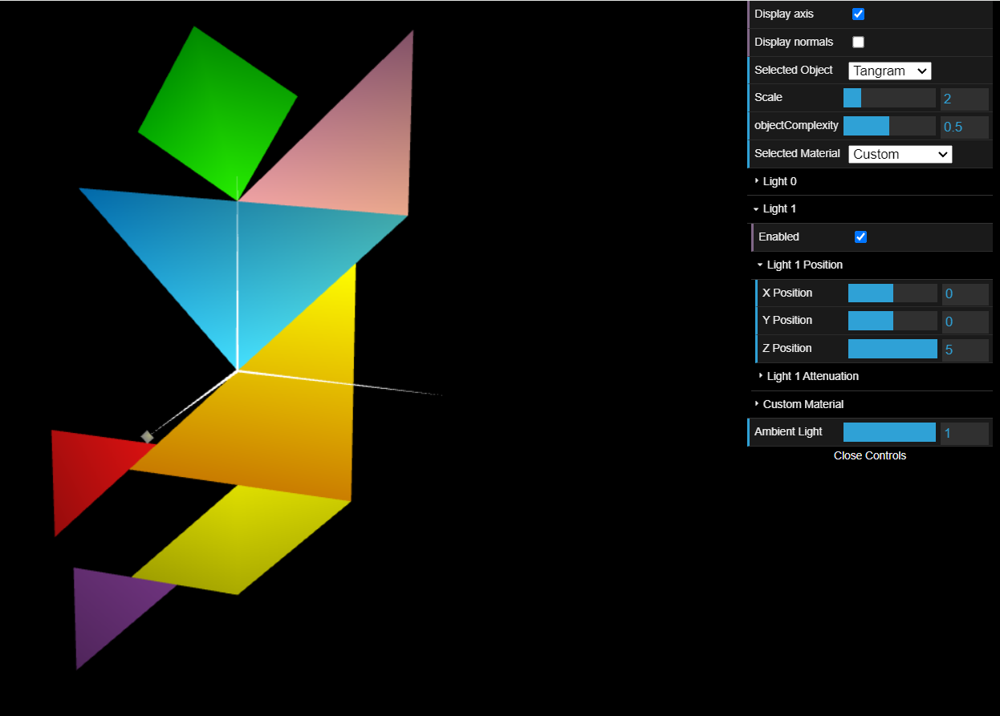
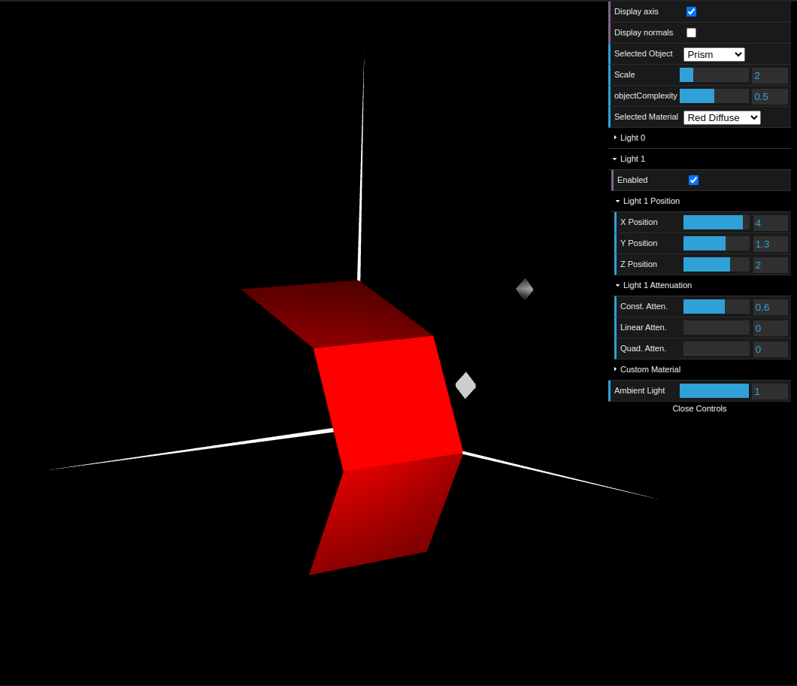
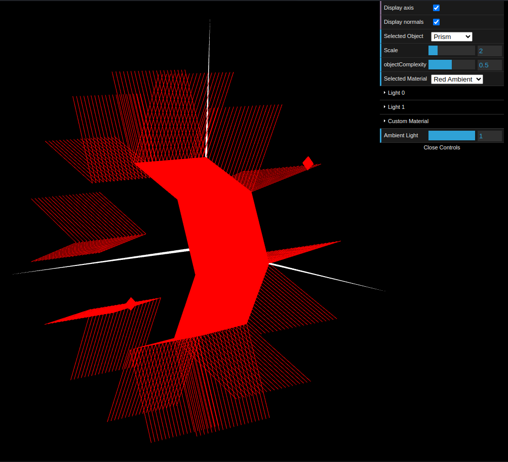
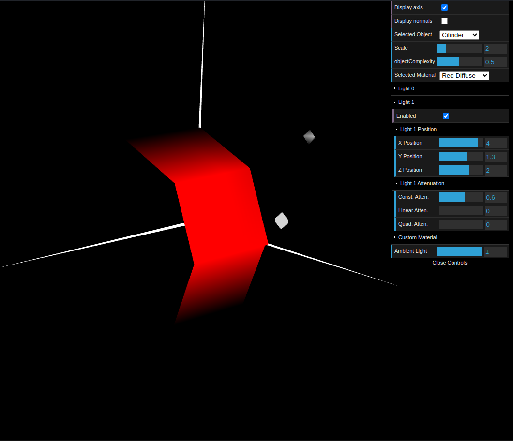

# CG 2023/2024

## Group T02G01

## TP 3 Notes

- In the first exercise, it took us some time to realize how the normal vectors definitions work. When dealing with the cube, we felt the need to use paper and pencil to better visualize the indexes' and normal vectors' orientations.
- In the second, the challenge was to be able to define the vertexes and indexes dinamically.
- The third exercise posed no great challenge for us, as it was a mere expansion of the previous.

